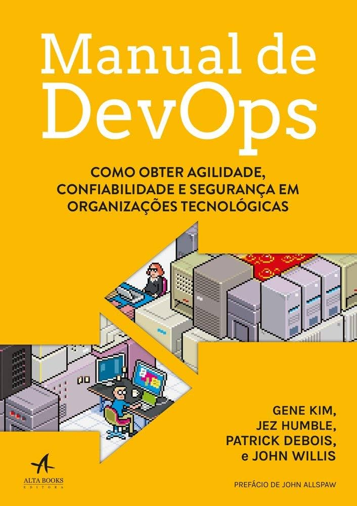

<h1 align="center">
  
</h1>

# Tema da Aula 

Turma Online ON32 - Metodologia DevOps | Semana 10 | 2024 | Professora Raissa Brizeno

### Professora Raissa
<h1>

</h1>
Sou formada em Bacharelado de Sistemas de infromação pela UFRPE, trabalho com DevOps há mais de seis anos e hoje  trabalho como Engenheira de plataforma no Picpay.

- 💌 Email: raissabrizeno@gmail.com
- 💼 LinkedIn: [in/raissabrizeno](https://www.linkedin.com/in/raissa-brizeno/)

### Instruções
Antes de começar, vamos organizar nosso setup.
* Fork esse repositório 
* Clone o fork na sua máquina (Para isso basta abrir o seu terminal e digitar `git clone url-do-seu-repositorio-forkado`)
* Entre na pasta do seu repositório (Para isso basta abrir o seu terminal e digitar `cd nome-do-seu-repositorio-forkado`)
* Caso precise, pode utilizar as instruções de Pull Request [aqui](./material/instrucoes-pull-request.md).

### Objetivo

Proporcionar uma compreensão abrangente dos conceitos, práticas e ferramentas que compõem o movimento DevOp.

### Resumo
O que veremos essa semana?
- Tema da Aula](#tema-da-aula)[

  - [Instruções](#instruções)
  - [Objetivo](#objetivo)

- [Conteúdo](#conteúdo)
  - [O que é DevOps e DevSecOps?](./material/001-o-que-e-devops-e-desecops.md)
  - [CI/CD:continuous integration e continuous delivery](./material/002-ci-cd.md)
  - [Componentes](./material/003-componentes.md)
  - [Serviços e Ferramentas](./material/004-servicos-e-ferramentas.md)
  - [Inteligência Artificial (IA) e DevOps](./material/005-Inteligencia-artificial-e-devops.md)
  - [Git Flow vs Trunk Based](./material/006-gitflow-e-trunk-bases.md)

- [Materiais](#materiais)
  - [PDF da Aula](./material/Aula_10_Metodologia_DevOps.pdf)

  
---
### Desafio Semanal 
- [Link para o desafio](./material/005-desafio-semanal.md)
---

### Exercícios 
* [Exercicio para sala](/exercicios/para-sala/)
* [Exercicio para casa](/exercicios/para-casa/)

---

### Links Úteis
* [Introdução ao DevOps](https://www.redhat.com/pt-br/topics/devops)
* [O que é CI/CD?](https://www.redhat.com/pt-br/topics/devops/what-is-ci-cd)
* [DevOps na prática: dia a dia do desenvolvedor](https://gaea.com.br/devops-na-pratica-dia-a-dia-do-desenvolvedor/)
* [Testes de Software: Definição, Conceitos e Exemplos](https://www.objective.com.br/insights/testes-de-software/#:~:text=O%20que%20%C3%A9%20um%20teste,corretamente%20tudo%20que%20ele%20prop%C3%B5e)
* [Conheça a incrível história do DevOps](https://gaea.com.br/conheca-a-incrivel-historia-do-devops/#:~:text=O%20embri%C3%A3o%20da%20hist%C3%B3ria%20do,desenvolvimento%20e%20opera%C3%A7%C3%B5es%20de%20TI)
* [Por que o versionamento de software é tão importante?](https://www.locaweb.com.br/blog/temas/codigo-aberto/versionamento-de-software-importancia/)
* [Saiba tudo sobre o Gitflow Workflow](https://www.atlassian.com/br/git/tutorials/comparing-workflows/gitflow-workflow)
[Trunk-based development](https://www.atlassian.com/continuous-delivery/continuous-integration/trunk-based-development)

### Links documentação de ferramentas:
* https://backstage.io/
* https://helm.sh/docs/
* https://tekton.dev/docs/
* https://argoproj.github.io/cd/
* [AWS Treinamento e Certificação](https://aws.amazon.com/pt/training/?nc2=type_a)

### Livros
<h1>
  
</h1>

Desenvolvido com :purple_heart:  por raisabrizeno

#TESTE
