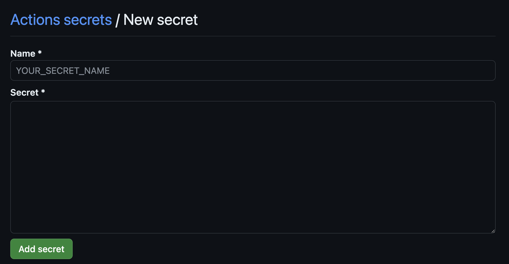

<h1 align="center">
  
</h1>

# Exercício prático de sala

Turma Online ON32 - Metodologia DevOps | Semana 10 | 2024 | Professora Raissa Brizeno

### Instruções

Antes de começar, vamos organizar nosso setup.

- Fork esse repositório
- Clone o fork na sua máquina (Para isso basta abrir o seu terminal e digitar `git clone url-do-seu-repositorio-forkado`)
- Entre na pasta do seu repositório (Para isso basta abrir o seu terminal e digitar `cd nome-do-seu-repositorio-forkado`)

### Sistema

Este projeto consiste em uma API de cadastro de usuários, que podem ser. Todos os usuários tem em comum:

- Nome
- Email
- Senha
- CPF

Ao informar o campo `zipCode`, o sistema busca os dados do CEP na base dos correios via integração com serviço externo.

Atualmente, essa API contém as seguintes APIs:

- `GET` http://localhost:3000/users
- `GET` http://localhost:3000/users/:id
- `POST` http://localhost:3000/users
- `PUT` http://localhost:3000/users/:id
- `DELETE` http://localhost:3000/users/:id

Existem algumas regras de validação para cadastro/edição de usuários, dentro as quais:

- Validação de CPF
- Validação de E-mail
- Validação de senha
  - Minimo de 8 digitos
  - Minimo de 1 letra maiúscula
  - Minimo de 1 caracter especial
  - Minimo de 1 número
- O e-mail deve ser único
- CPF deve ser único

Todos essas regras estão dentro do arquivo `user.service.ts`

### Objetivo da atividade

- Vamos refatorar o código e criar uma classe exclusiva para validações
- Vamos criar testes de unidade para as funções de validação
- Vamos criar testes de unidade para o cadastro, atualização, deleção e lista de usuários
- Vamos realizar testes de unidade/integração com um serviço de terceiro `ViaCEP` usando `mocks` e `spies`.
- Vamos criar testes de integração para as APIs

### Tecnologias

- Node `v18.12.1`

### Executar o projeto localmete:

- Instalação das dependências:

```sh
npm install
```

- Execução

```sh
npm run start:dev
```
Onde a aplicação vai estar rodando é no ```http://localhost:3000/users```

### Executar o projeto via Docker:

- Requisitos:

  Ter o [Docker instalado e rodando](https://docs.docker.com/)

- Adicione um arquivo chamado *Dockerfile* na raiz do 
projeto:

```sh
FROM node:18

# cria diretório
WORKDIR /app

# Copie o package.json e o package-lock.json para o diretório de trabalho
COPY package*.json ./

# Instale as dependências do projeto
RUN npm ci

# Copie o restante dos arquivos da aplicação para o diretório de trabalho
COPY . .

# Compile a aplicação TypeScript
RUN npm run build

# Exponha a porta que a aplicação usará (ajuste conforme necessário)
EXPOSE 3000

# Comando para rodar a aplicação
CMD ["npm", "start"]

```

- Buildando a imagem da aplicação em docker local com tag:

```sh
docker build -t aula-devops:1.0.0 .
```
Executando a aplicação em container docker local:

```sh
docker run -p 3000:3000 aula-devops:1.0.0
```
Onde a aplicação vai estar rodando é no ```http://localhost:3000/users```

### Construindo um pipeline para a aplicação no Git Acctions que faz push para o Docker Hub:

  - Crie as secrets que vai usar no projeto. *Settings* > *secrets and variables* > clique em *New repository secret* > *Add Secret*. Faça isso com todas que for usar no pipeline.
  
  <p align="center">

</p>

  - Crie uma pasta workflows na raiz do projeto e nela adicione um arquivo *pipeline.yaml* com o seguinte conteúdo:

```
name: CI

on:
  push:
    branches: [ "main" ]
  pull_request:
    branches: [ "main" ]

jobs:
  build:

    # executar comandos em um subdiretório
    runs-on: ubuntu-latest
    defaults:
      run:
        working-directory: ./exercicios/para-sala/users-api-aula

    # configuração do ambiente de execução do projeto Node.js
    strategy:
      matrix:
        node-version: [18.x]
        # See supported Node.js release schedule at https://nodejs.org/en/about/releases/

    steps:
    # clone do repositório
    - name: checkout 
      uses: actions/checkout@v4

    # pega a versão declarada do Node.j e configura no ambiente virtual
    - name: Use Node.js ${{ matrix.node-version }}
      uses: actions/setup-node@v3
      with:
        node-version: ${{ matrix.node-version }}

    # instala dependencias e roda os testes
    - run: npm ci
    - run: npm run build --if-present
    - run: npm test

    # lint para garantir que o código segue os padrões definidos
    - name: Run ESLint
      run: npm run lint

    # verificação de vulnerabilidades em pacotes
    - name: Run security audit
      run: npm audit

    # conferir se tem erros de tipagem
    - name: TypeScript Check
      run: npx tsc --noEmit

    # setamos o Docker Buildx no ambiente onde o job está sendo executado. 
    # Permite construir imagens Docker para várias arquiteturas 
    - name: Set up Docker Buildx
      if: github.ref == 'refs/heads/main'
      uses: docker/setup-buildx-action@v3

    # faz login no docker hub 
    - name: Log in to Docker Hub
      if: github.ref == 'refs/heads/main'
      uses: docker/login-action@v3
      with:
        username: ${{ secrets.DOCKER_USERNAME }}
        password: ${{ secrets.DOCKER_TOKEN }}

    - name: Build and push
      if: github.ref == 'refs/heads/main'
      uses: docker/build-push-action@v4
      with:
        context: exercicios/para-sala/users-api-aula
        push: true
        tags: raissabrizeno/users-api-aula:1.0.0

```


## Testes locais de aplicação: 

### Acessando rota via CURL

- GET lista de usuários:

```sh
curl -X GET 'http://localhost:3000/users'
```

- POST para criar um usuário novo (sucesso):

```sh
curl -X POST 'http://localhost:3000/users' -H 'Content-Type: application/json' --data '{
  "name": "Maria Joana",
  "email": "maria.joan@gmail.com",
  "password": "Test@1234",
  "cpf": "099.733.969-10"}'
```

**Obs:** ao realizar um novo cadastro com esse e-mail e/ou CPF deve retornar uma exceção.

- POST para criar usuário com CPF inválido:

```sh
curl -X POST 'http://localhost:3000/users' -H 'Content-Type: application/json' --data '{
  "name": "Maria Joana",
  "email": "maria.joan@gmail.com",
  "password": "Test@1234",
  "cpf": "099.733.969-11"
}'
```

- POST para criar usuário com e-mail inválido:

```sh
curl -X POST 'http://localhost:3000/users' -H 'Content-Type: application/json' --data '{
  "name": "Maria Joana",
  "email": "maria.joan-gmail.com",
  "password": "Test@1234",
  "cpf": "051.063.760-41"
}'
```

- POST para criar usuário com senha inválido:

```sh
curl -X POST 'http://localhost:3000/users' -H 'Content-Type: application/json' --data '{
  "name": "Maria Joana",
  "email": "maria.joan-gmail.com",
  "password": "Test1234",
  "cpf": "770.211.120-84"
}'
```

<p align="center">
Desenvolvido com :purple_heart: por Raissa Brizeno
</p>


