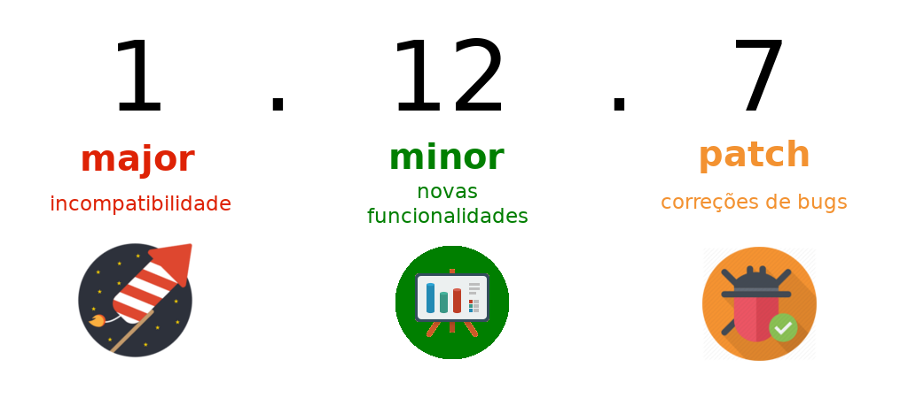
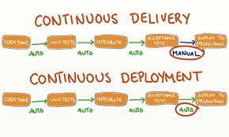
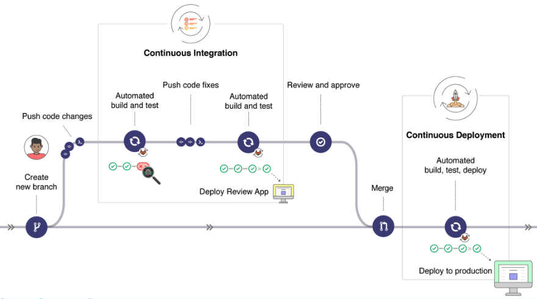

# CI/CD: continuous integration, continuous delivery e continuous deployment

  ## Integração Continua (Continuous Integration - CI)
  É uma prática de automatizar a integração de alterações de código de vários contribuidores em um único projeto de software permitindo que os desenvolvedores mesclem com frequência as alterações de código em um repositório central onde builds, análises e testes são executados. 

  Ferramentas automatizadas são usadas para afirmar a correção do novo código antes da integração no código principal.

  #### Build:
   É a compilação do código, no caso da esteira de CI esta compilação vai ocorrer sempre em um ambiente configurado de forma padrão e com todas as dependências da aplicação, evitando assim o "na minha máquina funciona".
 
  #### Testes:
  Servem para verificar se o software consegue entregar corretamente tudo que ele propõe, são importantes para garantir o funcionamento do software. Que cada uma das unidades de configurações consiga atuar sozinha e em conjunto, em busca da melhor experiência possível para os usuários. Nesse sentido, o teste de software é uma ferramenta fundamental tanto para que o software funcione quanto para que ele seja seguro.  Esses testes podem ser realizados em qualquer uma das partes do software, desde a unidade pequena até seu funcionamento como um todo, analisando também o número de dados e a sua segurança.

  #### Versionamento:
  É um processo para gestão e controle de mudanças de código. Ele envolve a atribuição de números ou rótulos, geralmente chamados de versões ou releases, a medida que o software evolui. 

  Dessa forma, o versionamento permite que:
  - Desenvolvedores e usuários acompanhem as mudanças;
  - Identificar versões estáveis;
  - Compreender as alterações introduzidas;
  - Gerenciar compatibilidade entre diferentes versões;
  - Possibilidade de reverter para versões anteriores se necessário.

  Versionamento semantico:

## Continuous Delivery e Continuous Deployment (CI)

|                              | **Entrega Contínua (Continuous Delivery)**                | **Deploy Contínuo (Continuous Deployment)**                |
|------------------------------|----------------------------------------------------------|------------------------------------------------------------|
| **Definição**                | Alterações de códigos são automaticamente preparadas para implantação | Alterações de códigos são liberadas automaticamente no ambiente de produção |
| **Benefícios**               | - Maior produtividade; Automação completa do processo de entrega; Bugs são encontrados e podem ser solucionados mais cedo; Novas atualizações lançadas com mais frequência | - Processo de liberação mais rápido; Não há necessidade de intervenções humanas; É fácil encontrar e consertar problemas; Novas atualizações lançadas com mais frequência |
| **Desafios**                 | - Requer um CI sólido; Requer uma boa suíte de testes; Precisa de um processo de implantação automatizado; Uso adequado de features flags | - Requer um excelente conjunto de testes; Documentação deve permanecer atualizada; Features flags se tornam uma parte inerente ao processo DevOps |

### Resumindo...

| **Integração Contínua** | **Entrega Contínua** | **Deploy Contínuo** |
|-------------------------|----------------------|---------------------|
| Refere-se à integração, construção e teste de código dentro do ambiente de desenvolvimento de software. Promove a prática de compartilhamento de código na comunidade de desenvolvimento de software, mesclando alterações em um repositório de código compartilhado centralmente. | Significa que o software que passou pelo build pode ser liberado para produção. Significa que um deploy pode acontecer com uma certa frequência, mas cada versão é decidida e liberada caso a caso. | Significa que as mudanças, através do pipeline, são automaticamente colocadas em produção. Habilita que múltiplos deploys possam ser realizados por dia. Requer que a Entrega Contínua esteja sendo feita. |

 