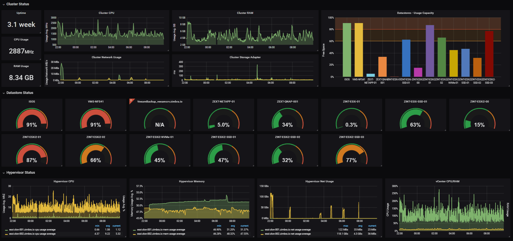
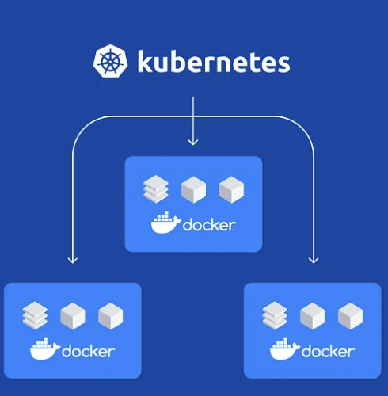
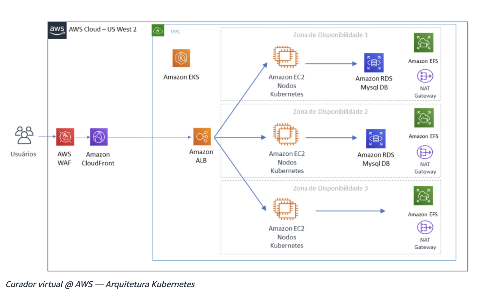

# Componentes

## Monitoramento
É o processo de observar, medir e analisar o desempenho, a disponibilidade e a funcionalidade de sistemas, aplicações e infraestrutura de TI, para com isso garantir que os sistemas estejam operando conforme o esperado, podendo identificar problemas rápidamente e proporcionar dados valiosos para melhorias contínuas.

- Desempenho: Aplicações e servidores;
- Infraestrutura;
- Segurança: Logs, Vulnerabilidades;
- Banco de dados;
- Experiência de usuário.

  
  
<em>Gráfico de Monitoramento com Grafana</em>

## Containers
Containers são pacotes leves e portáteis que contêm tudo o que uma aplicação precisa para ser executada, incluindo o código, runtime, bibliotecas e dependências.

  
  
<em>Exemplo de container com Docker</em>

## Orquestração de Containers

A orquestração de containers é uma prática que envolve a automação do gerenciamento, escalonamento e operação de containers. Ela facilita a gestão de um grande número de containers, especialmente em ambientes de produção complexos.

## Arquitetura de Infraestrutura

Refere-se ao planejamento, design e organização dos componentes tecnológicos que formam a base de TI de uma organização. Esses componentes incluem hardware, software, redes, armazenamento, servidores, sistemas operacionais, e outros recursos necessários para suportar as operações e os serviços de TI. A arquitetura de infraestrutura é fundamental para garantir que os sistemas sejam eficientes, seguros, escaláveis e capazes de atender às necessidades atuais e futuras da organização.

Exemplo: [Evoluindo diante de uma pandemia, como escalar para atender um país inteiro usando tecnologias sem servidor na AWS](https://aws.amazon.com/pt/blogs/aws-brasil/evoluindo-diante-de-uma-pandemia-como-escalar-para-atender-um-pais-inteiro-usando-tecnologias-sem-servidor-na-aws/)

