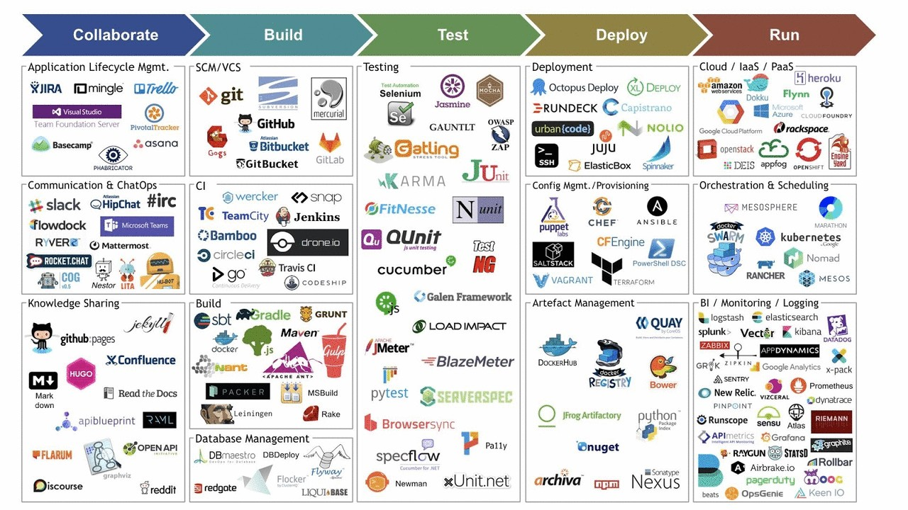

# Serviços e Ferramentas

As ferramentas e serviços são essenciais para automatizar e integrar processos ao longo do ciclo de vida de desenvolvimento de software, desde a codificação até a entrega e monitoramento. Essas ferramentas permitem que as equipes de desenvolvimento e operações colaborem de forma eficaz, automatizando tarefas repetitivas, garantindo a consistência, e aumentando a velocidade e a qualidade das entregas de software.

## Principais Categorias de Ferramentas e Serviços de DevOps

### Controle de Versão

#### Git: 
Sistema de controle de versão distribuído que permite que múltiplos desenvolvedores trabalhem em paralelo em um projeto. Git é a base para muitas outras ferramentas DevOps.

GitHub, GitLab, Bitbucket: Plataformas baseadas em Git que oferecem repositórios de código, revisão de código, integração contínua, e outras funcionalidades colaborativas.

#### Integração Contínua / Entrega Contínua (CI/CD); 

Jenkins: Uma das ferramentas de CI/CD mais populares, Jenkins é altamente extensível e suporta uma ampla gama de plugins para automação de build, teste e deployment.

GitLab CI/CD: Integrado ao GitLab, oferece pipelines de CI/CD para automação do desenvolvimento até a entrega.

CircleCI: Plataforma de CI/CD que permite automatizar o ciclo de vida do desenvolvimento com facilidade de configuração e escalabilidade.

Travis CI: Serviço de integração contínua que é amplamente utilizado para projetos de código aberto no GitHub.

Tekton: Tekton é uma estrutura (framework) open-source para construir pipelines de CI/CD como recursos nativos do Kubernetes.

### Gerenciamento de Configuração

Ansible: Ferramenta de automação que gerencia a configuração de sistemas, automação de tarefas e implantação de software. É conhecida por sua simplicidade e usa uma linguagem baseada em YAML.

Chef: Ferramenta de automação de infraestrutura que permite gerenciar a configuração de servidores de forma programática, usando uma linguagem baseada em Ruby.

Puppet: Ferramenta que automatiza a entrega e operação de software, com foco em gerenciamento de configuração e conformidade.

SaltStack: Ferramenta de automação que facilita o provisionamento, configuração e gerenciamento de infraestrutura.

Helm: é uma ferramenta de gerenciamento de pacotes para Kubernetes que simplifica a definição, instalação e atualização de aplicações em clusters Kubernetes. Os pacotes do Helm são chamados de Charts.

### Orquestração de Contêineres

Docker: Plataforma que permite criar, implantar e executar aplicativos em contêineres, que são pacotes portáteis e isolados de software.

Kubernetes: Plataforma de orquestração de contêineres que automatiza a implantação, escalabilidade e gerenciamento de aplicativos em contêineres. Kubernetes é amplamente usado para gerenciar ambientes de produção em escala.

### Infraestrutura como Código (IaC)

Terraform: Ferramenta de IaC que permite definir e provisionar infraestrutura em múltiplos provedores de nuvem usando uma linguagem declarativa.

AWS CloudFormation: Serviço da AWS que permite criar e gerenciar recursos da AWS por meio de modelos em YAML ou JSON.

Azure Resource Manager (ARM): Ferramenta de IaC da Microsoft para gerenciar recursos no Azure por meio de templates.

### Monitoramento e Observabilidade

Prometheus: Sistema de monitoramento open-source que coleta métricas em tempo real e permite o monitoramento de infraestrutura e aplicações.

Grafana: Ferramenta de visualização que se integra ao Prometheus e outras fontes de dados para criar painéis interativos de monitoramento.

ELK Stack (Elasticsearch, Logstash, Kibana): Conjunto de ferramentas para coleta, análise e visualização de logs. Muito utilizado para monitoramento e análise de eventos em tempo real.

Datadog: Plataforma de monitoramento e analytics que oferece monitoramento de infraestrutura, aplicações e logs em uma única interface.
Gerenciamento de Artefatos

JFrog Artifactory: Repositório de artefatos universal que gerencia binários e dependências em todo o ciclo de vida do software.
Nexus Repository: Ferramenta que oferece repositórios para armazenar artefatos, como bibliotecas, pacotes e containers, facilitando o controle de versões e o acesso seguro.

### Controle de Acesso e Gerenciamento de Segredos

HashiCorp Vault: Ferramenta para armazenar e acessar segredos (como senhas, tokens e chaves de API) de forma segura e centralizada.

AWS Secrets Manager: Serviço da AWS para gerenciar, distribuir e controlar o acesso a segredos, como credenciais e chaves de API.

### Automação de Deploy e Infraestrutura

Spinnaker: Plataforma de automação de deploy e gerenciamento de lançamentos, projetada para integração contínua e entrega contínua em múltiplos ambientes.

Argo CD: Ferramenta de CD (Continuous Delivery) para Kubernetes, que oferece uma abordagem GitOps para gerenciamento de aplicações.

### Nuvem e Serviços de Computação

AWS, Azure, Google Cloud Platform (GCP): Provedores de nuvem que oferecem uma ampla gama de serviços de infraestrutura, desde máquinas virtuais e armazenamento até serviços de AI/ML e IoT.

OpenStack: Plataforma de nuvem open-source que permite construir e gerenciar infraestruturas de nuvem privada e pública.

Enfim, existem uma infinidade de ferramentas no mercado atualmente, tando pagas quanto gratuítas, cada uma podendo ser usada em fases do processo. A imagem abaixo reflete um pouco disso.

