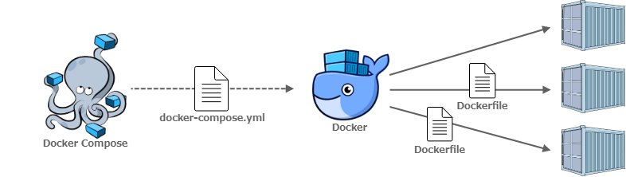

# Docker

[Docker](https://docs.docker.com/guides/getting-started/) é uma plataforma de software que permite criar, testar e implantar aplicações rapidamente. Ele faz isso usando uma tecnologia chamada containers. 

Um container é como uma "caixa" que contém tudo o que o software precisa para funcionar: código, bibliotecas, dependências, e até mesmo o sistema operacional. Isso garante que o aplicativo funcione da mesma forma, independentemente do ambiente onde ele está sendo executado (seja no seu computador, em um servidor na nuvem, ou em qualquer outro lugar).

Ainda não entendi...
tá bem, imagine que você é um cozinheiro:

- Cozinha tradicional: Quando você quer preparar uma refeição, você precisa de ingredientes, utensílios de cozinha, e um fogão. Mas se você viajar para outro lugar, pode ser que os utensílios, ingredientes ou o fogão sejam diferentes, e sua receita pode não sair como esperado.

- Cozinha com Docker: Agora, imagine que você tem uma caixa mágica onde você pode colocar todos os ingredientes, panelas, fogão, e tudo o que você precisa para preparar sua refeição. Quando você quer cozinhar em qualquer lugar do mundo, basta levar essa caixa com você. Não importa onde você esteja, sua receita vai sair exatamente igual porque a caixa já tem tudo o que você precisa, na mesma versão e configuração.


### O que o Docker faz?


- Empacotamento: Docker pega o seu aplicativo (como uma receita) e empacota tudo o que ele precisa (ingredientes, utensílios, fogão) dentro de um "container". Isso inclui o código do aplicativo, as bibliotecas que ele usa e até o sistema operacional que ele precisa.

- Portabilidade: Uma vez que o aplicativo está dentro de um container, você pode rodá-lo em qualquer lugar: no seu computador, em um servidor na nuvem, ou no computador de outra pessoa. O container garante que tudo funcione do mesmo jeito, independentemente de onde ele é executado.

- Isolamento: Cada container é isolado, o que significa que se você tiver vários containers rodando diferentes aplicativos, eles não vão interferir uns com os outros. É como ter várias caixas mágicas, cada uma com sua própria cozinha.

### Por que isso é útil?

- Facilidade de uso: Os desenvolvedores não precisam se preocupar em configurar todo o ambiente sempre que vão rodar um aplicativo. Com Docker, tudo já vem pronto dentro do container.

- Consistência: O aplicativo vai funcionar da mesma maneira, não importa onde ele esteja rodando, porque o container carrega tudo o que é necessário.

- Eficiência: Containers são leves e usam menos recursos do que máquinas virtuais tradicionais (que são como computadores completos rodando dentro de outro computador), então você pode rodar muitos containers no mesmo computador sem problemas.

Em resumo, Docker é como uma "caixa" que ajuda desenvolvedores a empacotar, distribuir e rodar seus aplicativos de maneira fácil e consistente, independentemente de onde esses aplicativos forem executados.

# Docker-compose

Docker Compose é uma ferramenta que complementa o Docker, facilitando a execução de múltiplos containers que formam uma aplicação. Pense no Docker Compose como um orquestrador que coordena vários containers, garantindo que eles sejam executados juntos de maneira organizada.



### O que o Docker Compose faz?

Quando você tem uma aplicação complexa que depende de vários serviços diferentes, como por exemplo:

- Um banco de dados (por exemplo, MySQL)
- Um servidor web (por exemplo, Nginx)
- Um serviço de cache (por exemplo, Redis)

Cada um desses serviços pode rodar em seu próprio container. Docker Compose permite que você defina todos esses serviços e suas interações em um único arquivo, chamado *docker-compose.yml*.

Nesse arquivo, você especifica:

- Quais containers serão usados (quais imagens Docker),
- Como eles se conectam entre si (rede),
- Configurações específicas para cada container (volumes, 
- variáveis de ambiente, portas expostas, etc.).

### Exemplo:

docker-compose.yaml

```sh
version: '3'
services:
  web:
    image: nginx
    ports:
      - "80:80"
  db:
    image: mysql
    environment:
      MYSQL_ROOT_PASSWORD: example

```

Acima, dois serviços estão definidos:

- Um servidor web usando a imagem Nginx, exposto na porta 80.
- Um banco de dados MySQL com uma senha especificada.

Para executar o docker-compose o comando é:
```sh 
docker-compose up
```
E para parar todos os serviços:
```sh
docker-compose down
```

### Principais Vantagens do Docker Compose:

- Facilidade de uso: Em vez de iniciar cada container manualmente, você define tudo em um único arquivo e controla toda a aplicação com comandos simples.
- Reprodutibilidade: Todo o ambiente de desenvolvimento ou produção pode ser descrito no docker-compose.yml, tornando fácil reproduzir o ambiente em qualquer lugar.
- Escalabilidade: Você pode escalar serviços específicos para rodar múltiplas instâncias com uma simples configuração, facilitando o gerenciamento de grandes aplicações.


Docker Compose é uma ferramenta que permite definir e gerenciar ambientes multi-containers de forma simples e eficiente. Ele é especialmente útil quando você tem uma aplicação composta por vários serviços que precisam ser executados e configurados juntos.

# Docker Desktop

Docker Desktop é uma aplicação que facilita o uso do Docker em sistemas operacionais de desktop, como Windows e macOS (principalmente em WINDOWS). Ele fornece uma interface gráfica para gerenciar containers e vem com tudo o que você precisa para começar a usar Docker em seu computador local.

### O que o Docker Desktop faz?

- Instalação Fácil: Docker Desktop simplifica a instalação do Docker no seu computador. Ele vem com todos os componentes necessários, incluindo o Docker Engine, Docker CLI (linha de comando), Docker Compose e outras ferramentas.

- Interface Gráfica (GUI): Embora o Docker tradicionalmente seja usado via linha de comando, o Docker Desktop inclui uma interface gráfica que facilita a visualização e gerenciamento dos containers, imagens, volumes e redes que você está utilizando.

### Integração com o Sistema Operacional:


- No Windows, o Docker Desktop configura automaticamente o subsistema necessário (como o WSL 2 - Windows Subsystem for Linux) para permitir a execução de containers Linux, que são os mais comuns.

- macOS: No macOS, Docker Desktop usa uma máquina virtual interna para rodar containers Linux.
Sincronização de Arquivos: Docker Desktop facilita a sincronização de arquivos entre o sistema de arquivos do host (seu computador) e os containers, permitindo desenvolvimento e testes mais rápidos.


### Principais Vantagens do Docker Desktop:

- Facilidade de uso: Simplifica a instalação e configuração do Docker em desktops, sem a necessidade de configurações complexas.
- Interface amigável: A interface gráfica ajuda a gerenciar containers e outros recursos de forma mais intuitiva.
Tudo-em-um: Vem com todas as ferramentas necessárias para trabalhar com Docker, incluindo Docker Compose e suporte para Kubernetes.

Docker Desktop é uma solução prática e completa para rodar Docker em ambientes de desktop, fornecendo tanto uma interface gráfica quanto ferramentas de linha de comando para facilitar o trabalho com containers.

```A nível de estudos quem tiver MacOs ou Linux usar terminal é uma boa prática para entender os comandos e funcionamento do Docker, no Window é mais complicado, então pode e deve seguir com a interface. No Windows, por padrão, o docker é startado automáticamente junto com a inicialização do sistema.```

*Para mais informações sobre Docker Desktop acesse a [Documentação Aqui](https://www.docker.com/products/docker-desktop/)*
